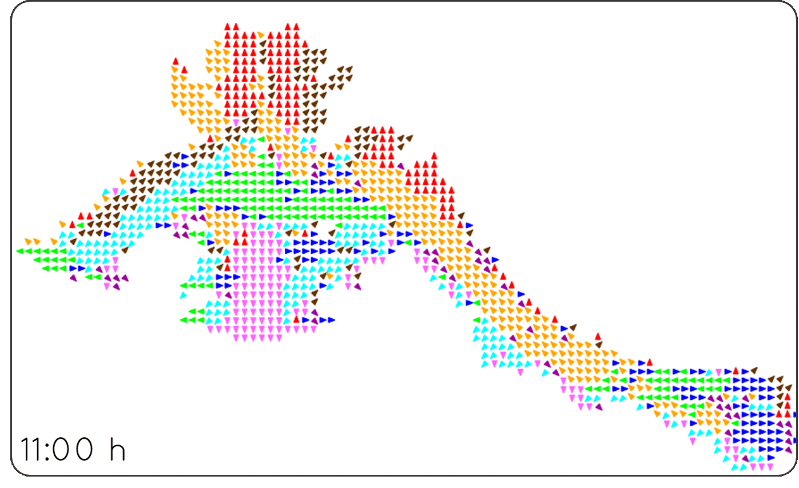

# STeFMap
Implementation of a time-dependent probabilistic map able to model and predict flow patterns of people in indoor environments. The proposed representation models the likelihood of motion direction on a grid-based map by a set of harmonic functions, which efficiently capture long-term variations of crowd movements over time [1].

## Tutorial:
### 1. Download data 
Link: https://mega.nz/#!EGoCGaQZ!IPYlx3P8aJPksK9-U5q3YrxUAE_zUoeCauz-0STm8Hc

This data is a downsampled version of the first 4 days of the dataset described in http://www.irc.atr.jp/crest2010_HRI/ATC_dataset/. We take the timestamp, x , y, and angle of each detection.

Put the 4 files in the data folder.

### 2. Install and launch FreMEn [2]
Link:https://github.com/sergimolina/fremen

Download the fremenarray package for ros, compile and run it (*rosrun fremenarray fremenarray*).

### 3. Execute main.py
This main script executes the full pipeline of the system (create the histograms for every interval of time specified, load the histograms for every cell to FreMEn, and predict the behavior of the people in the map for futtures times , and plot the predicted flowmap[1]). Before running the script be sure the fremenarray node explained in step 2 is running.

In the scripts folder all the scripts called from the main file are included, and can be called independently. This main script shows the arguments and the order to be executed in order to load 4 days of data.

### 4. Plot the spatio temporal flow map
After executing the main script, 5 extra files should be created, 4 of them containing the histograms of each day, and 1 file (*predicted_20121107_order1.txt*) containing the probabilities for each cell and orientation of the map. 

The plotting script basically takes in each time, the orientation with the higher probability and plots an arrow for that direction in the corresponding cell.

## Output
### Predicted flow map after two weeks of tranning

### Predicted probabilites for each orientation of a singlecell during 24h using a order 2 model

Probabilities            |  Orientations
:-------------------------:|:-------------------------:
 |  

## Contact
For further questions or doubts: smolinamellado@lincoln.ac.uk

## References
[1] S. Molina, G. Cielniak, T. Krajnik and T. Duckett. Modelling and Predicting Rhythmic Flow Patterns in Dyanmics Environments. In Towards  AutonomousRobotic Systems (TAROS), volume 10965, pages 135–146, 2018. 

[2] T.Krajnik, J.P.Fentanes, J.Santos, T.Duckett: FreMEn: FreMEn: Frequency Map Enhancement for Long-Term Mobile Robot Autonomy in Changing Environments.IEEE Transactions on Robotics, 2017.

